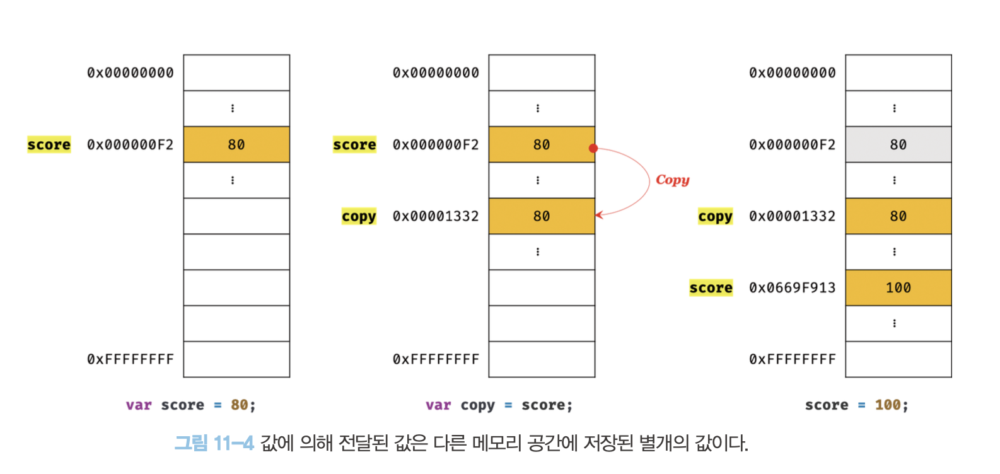

# 원시 값

원시 타입의 값, 즉 원시 값은 변경 불가능한 값이다. 변수의 상대 개념인 상수는 재할당이 금지된 변수를 말한다. 


## 문자열과 불변성

원시 값을 저장하려면 먼저 확보 해야하는 메모리 공간의 크기를 결정 해야한다. 이를 위해 원시 타입별로 메모리공간의 크기가 미리 정해져 있다고 했다. 대부분 1개의 문자는 2바이트의 메모리 공간에 저장된다. 따라서 문자열은 몇 개의 문자로 이뤄 졌느냐에 따라 필요한 메모리 공간의 크기가 결정된다.

자바스크립트는 개발자의 편의를 위해 `원시 타입`인 `문자열 타입`을 제공한다. 

```jsx
var str = 'Hello';
str = 'world';
```

위와 같이 문자열을 재할당 할 경우 문자열 `'Hello'`와 `'world'`는 모두 메모리에 존재한다. 식별자 `str`은 문자열 `'Hello'`를 가리키고 있다가 문자열 `'world'`를 가리키도록 변경되었을 뿐이다.

### 문자열의 한글자 변경해보기

```jsx
var str = 'string';
// 문자열은 유사 배열이므로 배열과 유사하게 인덱스를 사용해 각 문자에 접근할 수 있다.
console.log(str[0]); // s
// 원시 값인 문자열이 객체처럼 동작한다. 
console.log(str.length); // 6 
console.log(str.toUpperCase()); // STRING
```

원시 값을 객체처럼 사용하면 원시 값을 감싸는 `래퍼 객체`로 자동 변환된다.

```jsx
var str = 'string';
// 문자열은 유사 배열이므로 배열과 유사하게 인덱스를 사용해 각 문자에 접근할 수 있다. 
// 하지만 문자열은 원시 값이므로 변경할 수 없다. 이때 에러가 발생하지 않는다. str[0] = 'S';
console.log(str); // string
```

str[0] = 'S'처럼 이미 생성된 문자열의 일부 문자를 변경해도 반영되지 않는다. `이때 에러가 발생하지 않는다.`

### 값에 의한 전달 (Call by Value)

```jsx
var score = 80;
// copy 변수에는 score 변수의 값 80이 복사되어 할당된다.
var copy = score;

console.log(score, copy); // 80 80
console.log(score === copy); // true

// score 변수와 copy 변수의 값은 다른 메모리 공간에 저장된 별개의 값이다.
// 따라서 score 변수의 값을 변경해도 copy 변수의 값에는 어떠한 영향도 주지 않는다.
score = 100;
console.log(score, copy); // 100 80 
console.log(score === copy); // false
```

`copy`에 원시값을 갖는 `score`를 할당하면 할당받는 변수(`copy`)에는 할당되는 변수(`score`)의 원시 값 80이 복사되어 전달된다.
`score`변수와 `copy`변수의값 80은 다른 메모리 공간에 저장된 별개의 값이다.



실제 자바스크립트 엔진을 구현하는 제조사에 따라 실제 내부 동작방식은 미묘한 차이가 있을 수 있다.


파이썬은 이렇게 동작한다.

엄격하게 표현한다면 값이 아니라 메모리 주소가 전달되고 있다.

# 객체

객체는 프로퍼티의 개수가 정해져 있지 않으며, 동적으로 추가되고 삭제할 수 있다. 또한 프로퍼티의 값에도 제약이 없다. 따라서 객체는 원시 값과 같이 확보해야 할 메모리 공간의 크기를 사전에 정해 둘 수 없다.

> 자바스크립트는 클래스 없이 객체를 생성할 수 있으며, 객체가 생성된 이후라도 동적으로 프로퍼티와 메서드를 추가할 수 있다. 이는 사용하기 매우 편리하지만 성능 면에서는 이론적으로 클래스 기반 객체지향 프로그래밍 언어의 객체보다 생성과 프로퍼티 접근에 비용이 더 많이 드는 비효율적인 방식이다. 따라서 V8 자바스크립트 엔진에서는 프로퍼티에 접근하기 위해 동적 탐색 dynamic lookup 대신 `히든 클래스` `hidden class`라는 방식을 사용해 C++ 객체의 프로퍼티에 접근하는 정도의 성능을 보장한다.
> 

## 변경 가능한 값

객체는 변경 가능한 값이다.


객체는 변경 가능한 값이므로 메모리에 저장된 객체를 직접 수정할 수 있다. 이때 객체를 할당한 변수에 재할당을 하지 않았으므로 객체를 할당한 변수의 참조 값은 변경되지 않는다.

객체는 이러한구조적 단점에 따른 부작용이있다. 그것은 원시값과는 다르게 여러개의 식별자가 하나의 객체를 공유할 수 있다는 것이다.

### 참조에 의한 전달 (Call by Reference)

```jsx
var person = {
	name: 'Lee'
};
// 참조 값을 복사(얕은 복사)
var copy = person;
```

객체를 가리키는 변수(원본, `person`)를 다른 변수(사본, `copy`)에 할당하면 원본의 참조 값이 복사되어 전달
된다. 이를 참조에 의한 전달이라 한다.


원본 `person`과 사본`copy` 모두 동일한 객체를 가리킨다. 이것은 두 개의 식별자가 하나의 객체를 공유한다는 것 을 의미한다.

```jsx
var person = {
	name: 'Lee'
};

// 참조 값을 복사(얕은 복사). copy와 person은 동일한 참조 값을 갖는다.
var copy = person;
// copy와 person은 동일한 객체를 참조한다.
console.log(copy === person); // true
// copy를 통해 객체를 변경한다.
copy.name = 'Kim';
// person을 통해 객체를 변경한다.
person.address = 'Seoul';
// copy와 person은 동일한 객체를 가리킨다.
// 따라서 어느 한쪽에서 객체를 변경하면 서로 영향을 주고받는다. 
console.log(person); // {name: "Kim", address: "Seoul"} 
console.log(copy); // {name: "Kim", address: "Seoul"}
```