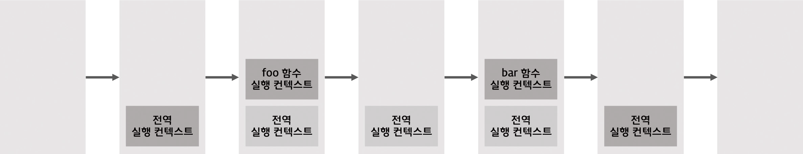

# 42장 비동기 프로그래밍

## 동기처리와 비동기 처리

### 함수 실행 및 종료 과정

함수 호출 → 함수 실행 컨텍스트 생성 → 실행 컨텍스트 스택에 푸시 → 함수 실행

함수 실행 종료 → 실행 컨텍스트 스택에서 팝되어 제거됨



실행 컨텍스트 스택

함수 호출 순서대로 스택에 푸시되어 순차적으로 실행됨

⇒ 함수의 실행 순서는 실행 컨텍스트 스택으로 관리

**자바스크립트 엔진은 단 하나의 실행 컨텍스트 스택**을 가지므로 동시에 2개 이상의 함수를 실행 불가

⇒ **싱글 스레드 방식**으로 동작

⇒ 처리에 시간이 걸리는 태스크 실행하면 **블로킹(작업중단)** 발생

### **동기 처리** synchronous

- 예제
  setTimeout 함수와 유사하게 일정 시간이 경과 한 이후에 콜백 함수를 호출하는 sleep 함수 구현

  ```jsx
  // sleep 함수는 일정 시간(delay)이 경과한 이후에 콜백 함수(func)를 호출한다.
  function sleep(func, delay) {
    // Date.now()는 현재 시간을 숫자(ms)로 반환한다.("30.2.1. Date.now" 참고)
    const delayUntil = Date.now() + delay;

    // 현재 시간(Date.now())에 delay를 더한 delayUntil이 현재 시간보다 작으면 계속 반복한다.
    while (Date.now() < delayUntil);
    // 일정 시간(delay)이 경과한 이후에 콜백 함수(func)를 호출한다.
    func();
  }

  function foo() {
    console.log("foo");
  }

  function bar() {
    console.log("bar");
  }

  // sleep 함수는 3초 이상 실행된다..
  sleep(foo, 3 * 1000);
  // bar 함수는 sleep 함수의 실행이 종료된 이후에 호출되므로 3초 이상 블로킹된다.
  bar();
  // (3초 경과 후) foo 호출 -> bar 호출
  ```


동기 처리

현재 실행 중인 태스크가 종료할 때까지 다음에 실행될 태스크가 대기하는 방식

**장** 태스크를 순서대로 하나씩 처리하므로 실행 순서 보장

**단** 앞선 태스크가 종료할 때까지 이후 태스크들이 블로킹됨

### **비동기 처리** asynchronous

- 예제

  ```jsx
  function foo() {
    console.log("foo");
  }

  function bar() {
    console.log("bar");
  }

  // 타이머 함수 setTimeout은 일정 시간이 경과한 이후에 콜백 함수 foo를 호출한다.
  // 타이머 함수 setTimeout은 bar 함수를 블로킹하지 않는다.
  setTimeout(foo, 3 * 1000);
  bar();
  // bar 호출 -> (3초 경과 후) foo 호출
  ```


비동기 처리

현재 실행 중인 태스크가 종료되지 않은 상태라 해도 다음 태스크를 곧바로 실행하는 방식

**장** 블로킹이 발생하지 않음

**단** 종료 태스크의 실행 순서가 보장되지 않음

비동기 함수는 콜백 패턴 사용

→ 콜백 헬을 발생시켜 가독성 저하, 비동기 처리 중 발생한 에러의 예외처리 곤란,

여러 개의 비동기 처리를 한 번에 처리하는 데 한계가 있음

**타이머 함수인 setTimeout 과 setInterval, HTTP 요청, 이벤트 핸들러는 비동기 처리 방식으로 동작**

## 이벤트 루프와 태스크 큐

자바스크립트는 싱글 스레드로 동작하므로 한 번에 하나의 태스크만 처리할 수 있지만, 브라우저가 동작하는 것을 살펴보면 많은 태스크가 동시에 처리되는 것처럼 느껴짐

ex) HTTP 요청을 통해 서버로부터 데이터를 가지고 오면서 동시에 렌더링

이처럼 자바스크립트의 동시성을 지원하는것이 바로 **이벤트 루프**임

### 이벤트 루프


이벤트 루프와 브라우저 환경

이벤트 루프는 브라우저에 내장되어 있는 기능

대부분의 자바스크립트 엔진은 크게 2개 영역으로 구분

- 콜 스택
  소스코드 평가 과정에서 생성된 실행 컨텍스트가 추가 / 제거되는 스택 자료구조인 실행 컨텍스트 스택이 바로 콜 스택임
- 힙
  객체가 저장되는 메모리 공간
  콜 스택의 요소인 실행 컨텍스트는 힙에 저장된 객체를 참조함
  특징 : 객체는 크기가 정해져 있지 않으므로 메모리 공간의 크기를 런타임에 결정(동적 할당)함
  → 객체가 저장되는 메모리 공간인 힙은 구조화 되어 있지 않음

이처럼 콜 스택과 힙으로 구성되어 있는 자바스크립트 엔진은 단순히 태스크가 요청되면 콜 스택을 통해 요청된 작업을 순차적으로 실행

비동기 처리에서 소스코드의 평가와 실행을 제외한 모든 처리는 자바스크립트 엔진을 구동하는 환경인 브라우저 또는 Node.js가 담당

예를 들어, 비동기 방식으로 동작하는 setTimeout의 콜백 함수의 평가와 실행은 자바스크립트 엔진이 담당하지만 호출 스케줄링을 위한 타이머 설정과 콜백 함수의 등록은 브라우저 또는 Node.js가 담당

이를 위해 브라우저 환경은 태스크 큐와 이벤트 루프 제공

- 태스크 큐
  setTimeout이나 setInterval과 같은 비동기 함수의 콜백 함수 또는 이벤트 핸들러가 일시적으로 보관되는 영역
- 이벤트 루프
  콜 스택에 현재 실행 중인 실행 컨텍스트가 있는지, 태스크 큐에 대기 중인 함수가 있는지 반복해서 확인
  만약 콜 스택이 비어있고, 태스크 큐에 대기 중인 함수가 있다면 이벤트 루프는 순차적으로 태스크 큐에 대기 중인 함수를 콜 스택으로 이동시킴
  즉, 태스크 큐에 일시 보관된 함수들은 비동기 처리 방식으로 동작
- 예제

  ```jsx
  function foo() {
    console.log("foo");
  }

  function bar() {
    console.log("bar");
  }

  setTimeout(foo, 0); // 0초(실제는 4ms) 후에 foo 함수가 호출된다.
  bar();
  ```

  - 동작 과정

    1. 전역 코드가 평가되어 전역 실행 컨텍스트가 생성되고 콜 스택에 푸시된다.

    2. 전역 코드가 실행되기 시작하여 setTimeout 함수가 호출된다. 이때 setTimeout 함수의 실행 컨텍스트가 생성되고 콜 스택에 푸시되어 현재 실행 중인 실행 컨텍스트가 된다.
       브라우저의 Web API인 타이머 함수도 함수이므로 함수 실행 컨텍스트를 생성한다.
    3. setTimeout 함수가 실행되면 콜백 함수를 호출 스케줄링하고 종료되어 콜 스택에서 제거된다.
       이때 호출 스케줄링, 즉 타이머 설정과 타이머가 만료되면 콜백 함수를 태스크 큐에 푸시하는 것은
       브라우저 역할이다.

    4. 브라우저가 수행하는 4-1과 자바스크립트 엔진이 수행하는 4-2는 병행 처리된다.
       4-1. 브라우저는 타이머를 설정하고 타이머의 만료를 기다린다. 이후 타이머가 만료되면 콜백 함수 foo가 태스크 큐에 푸시된다. 예제의 경우 지연 시간(delay)가 0이지만 최소 지연 시간 4ms가 지정된다.
       따라서 4ms 후에 콜백 함수 foo가 태스크 큐에 푸시되어 대기하게 된다. 이 처리 또한 자바스크립트 엔진이 아니라 브라우저가 수행한다.
       4-2. bar 함수가 호출되어 bar 함수의 실행 컨텍스트가 생성되고 콜 스택에 푸시되어 현재 실행 중인 실행 컨텍스트가 된다. 이후 bar 함수가 종료되어 콜 스택에서 제거된다. 이때 foo 함수는 4ms 시간이 경과 했더라도 아직 태스크 큐에서 대기 중이다.(아직 전역 컨텍스트가 남아 있기 때문에)
    5. 전역 코드 실행이 종료되고 전역 실행 컨텍스트가 콜 스택에서 제거된다. 이로서 콜 스택에는 아무것도 없다.

    6. 이벤트 루프에 의해 콜 스택이 비어 있음이 감지되고 태스크 큐에서 대기 중인 콜백 함수 foo가 이벤트 루프에 의해 콜 스택에 푸시되어 실행된다. 이후 foo 함수가 종료되어 콜 스택에서 제거된다.
       비동기 함수인 setTimeout의 콜백 함수는 태스크 큐에 푸시되어 대기하다가 콜 스택이 비게 되면, 다시 말해 전역 코드 및 명시적으로 호출된 함수가 모두 종료하면 비로소 콜 스택에 푸시되어 실행됨

**자바스크립트 엔진은 싱글 스레드로 동작하지만 브라우저는 멀티 스레드로 동작**
